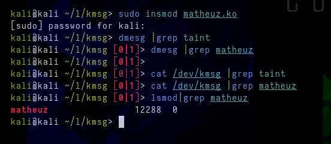

# Taint
POC/Demo hiding taint message from /dev/kmsg and dmesg.

To hide `/proc/sys/kernel/tainted`, you can check my group, there is the source code and everything explained as to what each function does

*Rootkit Researchers*
This community dedicated to researchers interested in rootkits linux and windows, ring0 and ring3, both from an attack/stealth and defense/forensics perspective. The objective of this group is to bring together enthusiasts in this area to share information, research, techniques and knowledge. Furthermore, we seek to foster collaboration between members, promoting new research and joint discoveries.

- Join: https://discord.gg/66N5ZQppU7
